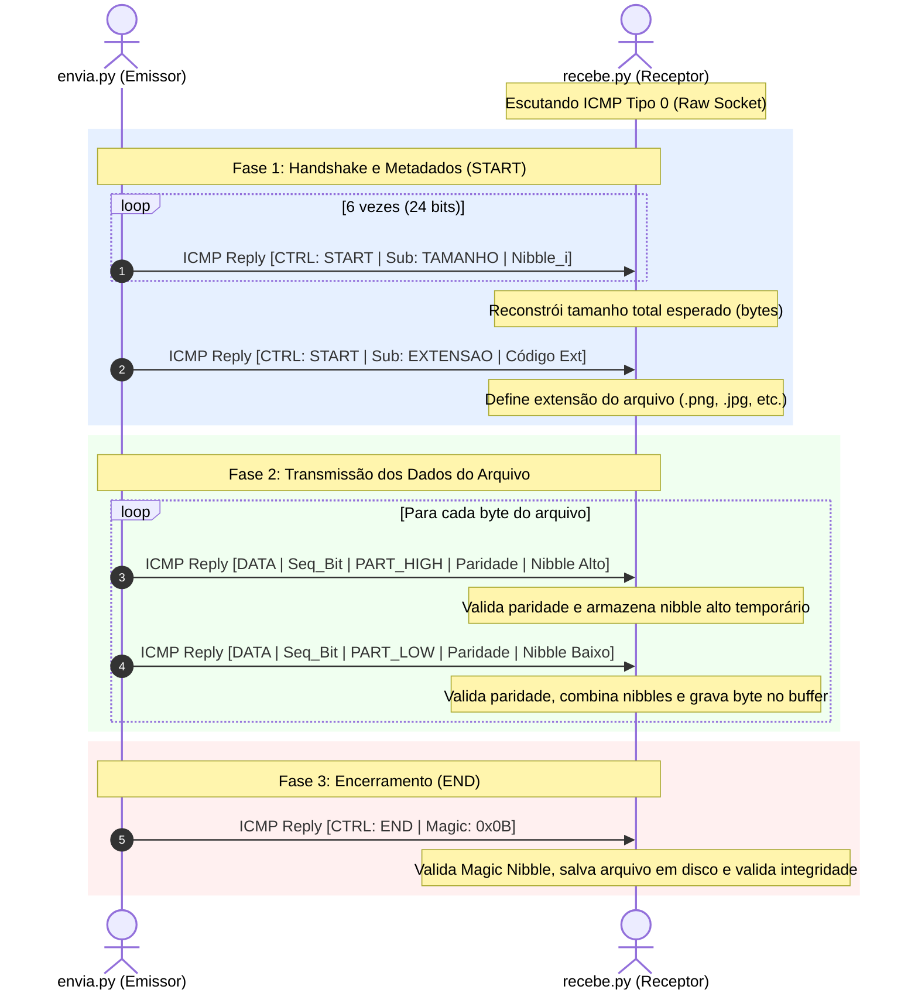

# 🛰️ Data Hiding & Esteganografia de Rede via ICMP

Projeto desenvolvido em Python para implementação de um **canal encoberto (*covert channel*)** e **esteganografia de rede (*network steganography*)**. A ferramenta permite a transmissão invisível de arquivos arbitrários (imagens, binários, documentos) ocultando os dados diretamente dentro do payload de pacotes **ICMP Echo Reply (Tipo 0)** utilizando Raw Sockets.

---

## 📌 Sumário

- [Visão Geral](#-visão-geral)
- [Como Funciona](#-como-funciona)
  - [Ocultação no Payload ICMP](#ocultação-no-payload-icmp)
  - [Estrutura do Byte Esteganográfico](#estrutura-do-byte-esteganográfico)
  - [Detalhamento Bit a Bit](#detalhamento-bit-a-bit)
- [Fluxo de Comunicação](#-fluxo-de-comunicação)
- [Estrutura do Repositório](#-estrutura-do-repositório)
- [Pré-requisitos e Permissões](#-pré-requisitos-e-permissões)
- [Como Executar](#-como-executar)
  - [1. Configurações Prévias](#1-configurações-prévias)
  - [2. Executando o Receptor (`recebe.py`)](#2-executando-o-receptor-recebepy)
  - [3. Executando o Emissor (`envia.py`)](#3-executando-o-emissor-enviapy)
- [Tabela de Extensões Suportadas](#-tabela-de-extensões-suportadas)
- [Mecanismos de Confiabilidade](#-mecanismos-de-confiabilidade)
- [Aviso Legal (Disclaimer)](#-aviso-legal-disclaimer)

---

## 🔍 Visão Geral

A esteganografia tem como objetivo ocultar a **existência** da comunicação, diferentemente da criptografia tradicional, que visa ocultar apenas o **conteúdo**.

Este projeto explora o protocolo ICMP (*Internet Control Message Protocol*), comumente associado ao utilitário `ping`. Em condições normais, requisições de eco (`Echo Request - Tipo 8`) e respostas de eco (`Echo Reply - Tipo 0`) carregam payloads arbitrários de preenchimento (ex.: alfabeto ou sequências numéricas).

Nossa abordagem substitui cirurgicamente apenas o **primeiro byte (índice 0)** do payload padrão de resposta ICMP por um byte especialmente forjado, mantendo o restante do payload inalterado e recalculando o **Checksum da RFC 1071** para garantir total conformidade com a pilha de rede.

---

## ⚙️ Como Funciona

### Ocultação no Payload ICMP

Cada byte do arquivo a ser transmitido é fatiado em **2 nibbles** (4 bits cada):
1. **Nibble Alto** (bits 7 a 4)
2. **Nibble Baixo** (bits 3 a 0)

Cada nibble é transmitido individualmente em um pacote ICMP separado. Portanto, um arquivo de $N$ bytes gera $2N$ pacotes de dados, além dos pacotes de controle inicial (START) e encerramento (END).

```
Arquivo Original (1 Byte: 0xA5 -> 1010 0101)
                    │
       ┌────────────┴────────────┐
       ▼                         ▼
Nibble Alto: 0xA (1010)   Nibble Baixo: 0x5 (0101)
       │                         │
       ▼                         ▼
 Pacote ICMP 1             Pacote ICMP 2
[Byte 0: Estego High]     [Byte 0: Estego Low]
```

### Estrutura do Byte Esteganográfico

O byte injetado no índice `0` do payload possui 8 bits divididos logicamente em campos de controle, sincronismo, paridade e carga útil:

```
 ┌───────┬──────────┬──────────┬──────────┬───────────────────────────┐
 │ Bit 7 │  Bit 6   │  Bit 5   │  Bit 4   │ Bits 3, 2, 1 e 0 (Nibble) │
 └───────┴──────────┴──────────┴──────────┴───────────────────────────┘
```

### Detalhamento Bit a Bit

#### 1. Contexto de DADOS (`Bit 7 == 0`):
Transporta uma fração (nibble) dos dados reais do arquivo.

| Bit | Campo | Descrição |
| :---: | :--- | :--- |
| **7** | **Contexto (`CTX_DATA`)** | Fixo em `0` para indicar pacote com dados úteis. |
| **6** | **Sequência Alternada** | Alterna entre `0` e `1` a cada byte montado (usando XOR), permitindo identificar perda ou duplicação. |
| **5** | **Parte do Nibble** | `0`: Nibble Alto (bits 7–4 do byte original)<br>`1`: Nibble Baixo (bits 3–0 do byte original). |
| **4** | **Bit de Paridade** | Paridade calculada sobre os 4 bits do nibble (`count("1") % 2`). Se houver discrepância na chegada, o pacote é descartado. |
| **3..0** | **Payload (Nibble)** | Os 4 bits de dados transmitidos. |

#### 2. Contexto de CONTROLE (`Bit 7 == 1`):
Configura parâmetros de transmissão, metadados e encerramento de sessão.

| Bit | Campo | Descrição |
| :---: | :--- | :--- |
| **7** | **Contexto (`CTX_CTRL`)** | Fixo em `1` para indicar pacote de controle. |
| **6** | **Comando (`CMD`)** | `0`: Início de sessão (`CMD_START`)<br>`1`: Término de sessão (`CMD_END`). |
| **5** | **Subcomando** | No START: `0` para transmitir tamanho do arquivo / `1` para extensão do arquivo. |
| **4** | **Validador de Controle** | Fixo em `1` para atestar a autenticidade do comando de controle. |
| **3..0** | **Valor do Controle** | - **START (Tamanho)**: Transporta 1 dos 6 nibbles do tamanho do arquivo (suporte a até 16 MB).<br>- **START (Extensão)**: Transporta o código identificador da extensão.<br>- **END (Término)**: Transporta o número mágico `0x0B` (`MAGIC_NIBBLE`). |

---

## 🔄 Fluxo de Comunicação



---

## 📁 Estrutura do Repositório

```text
Data_Hiding-Steganography/
├── envia.py                   # Script responsável pela leitura, codificação e envio do arquivo
├── recebe.py                  # Script receptor que decodifica pacotes e remonta o arquivo
├── teste.png                  # Imagem de amostra para testes de transmissão
├── small_file.png             # Arquivo reduzido para validação rápida de fluxo
├── Ideias/
│   ├── Prototipo.txt          # Anotações e documentação do planejamento dos bits
│   └── Explicação_Prototipo.png# Diagrama esquemático manual da arquitetura
└── README.md                  # Documentação do projeto
```

---

## 🛡️ Pré-requisitos e Permissões

1. **Python 3.8+** instalado.
2. **Permissões Administrativas (Root / Administrador)**:
   - A criação de sockets raw (`socket.SOCK_RAW` com protocolo `IPPROTO_ICMP`) requer privilégios elevados no sistema operacional:
     - **Linux**: Execute com `sudo` ou conceda capacidades com `sudo setcap cap_net_raw+ep $(which python3)`.
     - **Windows**: Abra o PowerShell ou Prompt de Comando como **Administrador**.

---

## 🚀 Como Executar

### 1. Configurações Prévias

Abra os arquivos `envia.py` e `recebe.py` para conferir os endereços IP de comunicação:

- **Teste Local (Loopback)**: Mantenha `ORIGEM = "127.0.0.1"` e `DESTINO = "127.0.0.1"`.
- **Entre Máquinas / Containers**: Configure `DESTINO` no `envia.py` para o IP do receptor e ajuste `ORIGEM` de acordo com a interface correspondente.
- **Flag de Transmissão (`envia.py`)**:
  - Certifique-se de definir `ENVIAR = 1` no topo de `envia.py` para efetivamente disparar os pacotes pela rede (quando `0`, roda em modo de simulação local).

### 2. Executando o Receptor (`recebe.py`)

Inicie primeiro o receptor para que ele fique aguardando os pacotes na interface:

```bash
# Como Administrador / root
python recebe.py
```

*Opcional*: você pode especificar diretamente o nome de saída do arquivo:
```bash
python recebe.py imagem_recebida.png
```

### 3. Executando o Emissor (`envia.py`)

Com o receptor em execução, inicie o envio do arquivo:

```bash
# Como Administrador / root (envio padrão: teste.png)
python envia.py

# Ou especificando outro arquivo via linha de comando:
python envia.py caminho/para/seu_arquivo.png
```

Durante o envio e recebimento, você verá o progresso em tempo real a cada 10% transmitido:
```text
1024/10240 bytes enviados: 10.00% já enviados
...
Transmissão concluída com sucesso!
```

---

## 🏷️ Tabela de Extensões Suportadas

O código de extensão é transmitido no início da sessão através de 4 bits:

| Código Hexadecimal | Extensão Mapeada | Formato |
| :---: | :---: | :--- |
| `0x0` | `.bin` | Arquivo binário genérico (fallback) |
| `0x1` | `.jpg` | Imagem JPEG |
| `0x2` | `.png` | Imagem PNG |

> 💡 *Para adicionar novos formatos, basta incluir o mapeamento no dicionário `MAPA_EXTENSAO` em ambos os arquivos (`envia.py` e `recebe.py`).*

---

## 🔒 Mecanismos de Confiabilidade

- **Controle de Vazão (*Rate Limiting*)**: Configurado através de `PAUSA_ENTRE_PACOTES = 0.005` (5 ms) para prevenir saturação do buffer de socket do sistema operacional e descarte de pacotes em rajada (*burst*).
- **Detecção de Erros por Paridade**: Cada nibble carrega um bit de paridade calculado. Pacotes alterados em trânsito são prontamente detectados e descartados.
- **Validação de Número Mágico**: O comando de encerramento (`CMD_END`) exige a verificação do `MAGIC_NIBBLE` (`0x0B`), evitando finalizações prematuras por tráfego ICMP alheio à transmissão.
- **Checksum RFC 1071**: O cabeçalho ICMP tem seu checksum recalculado com precisão matemática, garantindo que pilhas de rede intermediárias não descartem o pacote como malformado.

---

## ⚠️ Aviso Legal (Disclaimer)

Este projeto foi desenvolvido estritamente para **fins acadêmicos, educacionais e de pesquisa** em segurança da informação, esteganografia digital e análise forense de redes. O uso de técnicas de canal oculto em redes corporativas ou de terceiros sem autorização prévia e expressa é estritamente proibido.